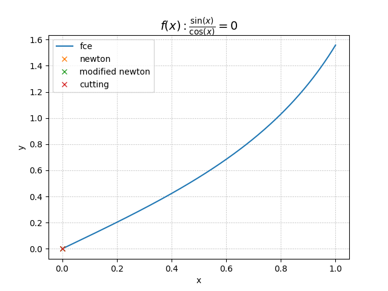

# MMNM - řešení nelineárních rovnic
Projekt do numerických metod


## nápověda programu
```bash
$ ./main.py -h
================================================================================
usage: wykys numeric equation solver [-h] [-q EQUATION] [-e EPS]
                                     [-i INTERVAL INTERVAL] [-m MAX_I] [-p]

optional arguments:
  -h, --help            show this help message and exit
  -q EQUATION, --equation EQUATION
                        user equation
  -e EPS, --epsilon EPS
                        calculation accuracy
  -i INTERVAL INTERVAL, --interval INTERVAL INTERVAL
                        start points
  -m MAX_I, --max_i MAX_I
                        maximum iteration
  -p, --plot            plot graph

```

## demonstrační výstup
```bash
$ ./main.py -q 'sin(x)/cos(x)' -i 0 1 -e 0.0001 -p
================================================================================
sin(x)
──────
cos(x)
--------------------------------------------------------------------------------
          method                     x                     y  iteration valid
          newton  2.43056159508932e-11  2.43056159508932e-11          3    OK
 modified newton   5.04727212417882e-5   5.04727212846478e-5          6    OK
         cutting                     0                     0          0    OK
================================================================================

```

